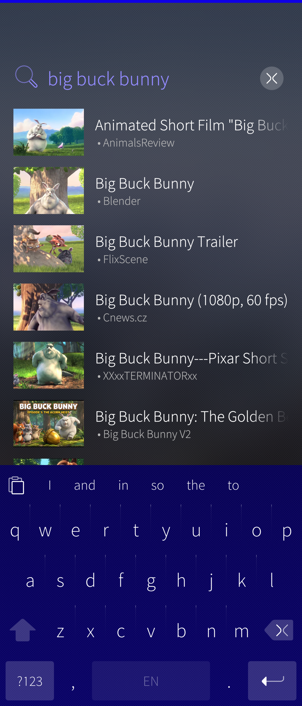
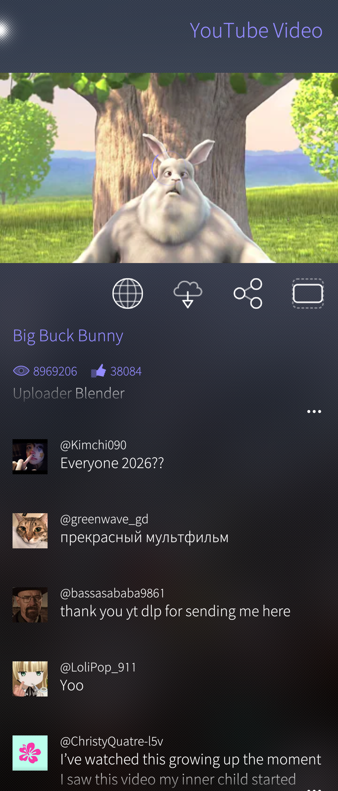
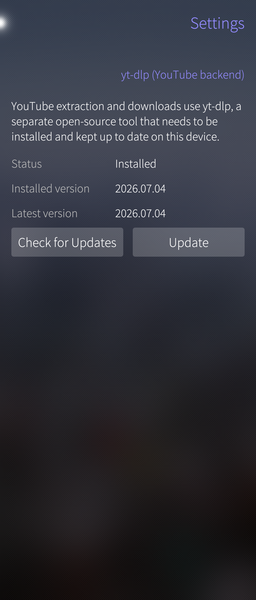

<div align="center">


# SailReel

**Stream and download YouTube video on Sailfish OS.**

[](https://github.com/shano/harbour-sailreel/actions/workflows/release.yml)
[](https://github.com/shano/harbour-sailreel/releases/latest)
[](LICENSE)

</div>

---

> **This is a fork.** Upstream is [flypig/harbour-newpipe](https://codeberg.org/flypig/harbour-newpipe)
> on Codeberg (there packaged as `harbour-sailpipe`/"SailPipe"). Renamed here
> to avoid clashing with the upstream package if both are ever installed.
> Most of the code in this fork was written by AI coding agents (Claude)
> rather than by hand — review accordingly before trusting it with your
> accounts or data.

## What it is

A native Sailfish Silica app for searching, streaming, and downloading
video from **YouTube**.

Search, browse channels and playlists, read comments, play video in-app
with full media controls (MPRIS-integrated, so lock-screen and Bluetooth
controls work), and download videos straight to your device's `Videos`
folder via the system Transfer Engine.

<p align="center">



</p>

## yt-dlp integration

All YouTube access goes through [yt-dlp](https://github.com/yt-dlp/yt-dlp),
a standalone binary the app downloads and manages itself (Settings →
yt-dlp) — never bundled or auto-run without your say-so. Kept independent
of app releases, so YouTube support can be patched the moment upstream
yt-dlp ships a fix, without waiting on a SailReel update.

The yt-dlp binary is downloaded straight from GitHub Releases and
verified against its published SHA-256 checksum before install.

## Installing

Grab the latest `.rpm` from [Releases](https://github.com/shano/harbour-sailreel/releases/latest)
and install it via Storeman, File Browser, or:

```
pkcon install-local --allow-untrusted harbour-sailreel-<version>.aarch64.rpm
```

Built for both **aarch64** (e.g. Xperia 10 II/III and other 64-bit ARM
devices) and **armv7hl** (older 32-bit ARM devices).

## Building from source

CI builds via the Sailfish Platform SDK — see
[`.github/workflows/release.yml`](.github/workflows/release.yml) for the
full pipeline: [`mb2`](https://docs.sailfishos.org/Tools/Sailfish_SDK/)
builds the RPM against the target Sailfish OS release. Push a `vX.Y.Z`
tag to trigger a release build.

## Acknowledgements

- [flypig](https://codeberg.org/flypig) — original NewPipe-for-Sailfish
  author
- [legacychimera247](https://codeberg.org/legacychimera247) — contributor
- [yt-dlp](https://github.com/yt-dlp/yt-dlp) contributors

This project uses [Weblate](https://weblate.org/) translation software to
support localisation.

## License

[GPLv3](LICENSE)
